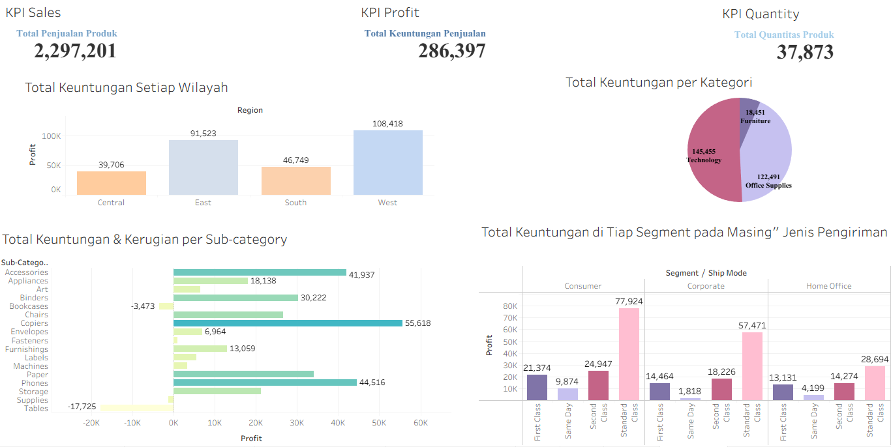

## 📊 Analisis Tren Penjualan Superstore dari Berbagai Aspek dan Sektor 📊

📌 Ringkasan Proyek
Proyek ini bertujuan untuk menganalisis data penjualan Superstore secara menyeluruh, mencakup evaluasi performa keuntungan hingga identifikasi area kerugian. Melalui eksplorasi dari berbagai aspek dan sektor bisnis, proyek ini menghasilkan *insight* strategis dan rekomendasi evaluasi untuk mengoptimalkan keputusan bisnis di masa depan.

🎯 Tujuan Analisis
* Menganalisis performa penjualan dan tingkat profitabilitas di berbagai segmen dan wilayah.
* Mengidentifikasi kategori atau sub-kategori produk yang memberikan keuntungan tertinggi maupun yang mengalami kerugian.
* Memberikan rekomendasi berbasis data untuk evaluasi strategi bisnis Superstore.

🛠️ Tools & Teknologi
* **Google Cloud BigQuery (SQL)**: Pembersihan data (*data cleaning*) dan penyaringan data (*filtering*).
* **Google Colab (Python)**: Pengolahan data serta pembuatan visualisasi grafik eksploratif.
* **Microsoft Excel**: Menyimpan data mentah, mencatat hasil olahan dari SQL, dan membuat grafik analisis.
* **Tableau & Power BI**: Pembuatan *dashboard* interaktif dan visualisasi data yang mendalam.
* **Microsoft Word**: Penyusunan laporan akhir analisis secara terstruktur.

 📊 Tampilan Dashboard
*  
💡 Insight Utama (Key Findings)
Berdasarkan visualisasi *dashboard* di atas:
* **Total Performa**: Total penjualan mencapai **2,297,201** dengan total keuntungan sebesar **286,397** dan total kuantitas produk terjual sebanyak **37,873** unit.
* **Kategori Produk**: Kategori **Technology** menyumbang keuntungan terbesar (**145,455**), diikuti oleh **Office Supplies** (**122,491**).
* **Area Kerugian**: Beberapa sub-kategori mengalami kerugian, dengan kerugian terbesar pada sub-kategori **Tables** (**-17,725**) dan **Bookcases** (**-3,473**).
* **Sektor Pengiriman & Segmen**: Pengiriman kelas **Standard Class** menghasilkan keuntungan tertinggi di seluruh segmen konsumen (*Consumer*, *Corporate*, dan *Home Office*).

📁 Struktur Repositori
* `data/` : Berisi data mentah dan data hasil olahan.
* `dashboards/` : Berisi file *dashboard* interaktif (Tableau/Power BI).
* `images/` : Berisi *screenshot* dan aset gambar pendukung.
* `reports/` : Berisi dokumen laporan analisis lengkap dalam format PDF.

* ⚙️ Alur Kerja Analisis (*Data Pipeline*)
1. **Pembersihan & Penyaringan Data**: Data mentah dibersihkan dan difilter menggunakan **Google Cloud BigQuery (SQL)** untuk memastikan kualitas data.
2. **Eksplorasi & Validasi**: Melakukan pengecekan lanjutan dan pembuatan grafik eksploratif menggunakan **Python (Google Colab)**.
3. **Penyimpanan & Pencatatan**: Hasil olahan data disimpan dan direkap menggunakan **Microsoft Excel**.
4. **Visualisasi & Dashboard**: Membangun *dashboard* interaktif menggunakan **Tableau & Power BI** untuk menyajikan metrik kunci.
5. **Pelaporan**: Menyusun dokumen evaluasi dan rekomendasi strategis dalam format **Microsoft Word**.

